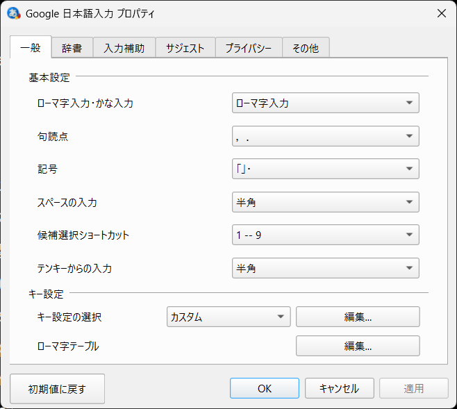
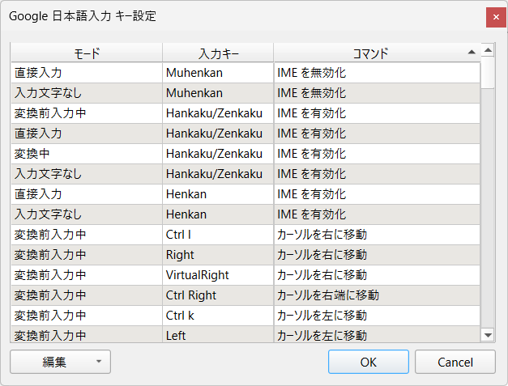

Macでは，日本語入力のONとOFFのキーが明確に区別されている．
Windowsでは「半角/全角」がトグルする．
覚えるべきキーは1つで良いが，その時の状態によって動作が異なるのが鬱陶しい．

状態にかかわらずキーの効果を一定にするには以下の方法が使える．

- Google日本語入力のプロパティを開く
- [一般] - [キー設定] - [キー設定の選択] - [編集]を選択

- 入力モードのどの段階でも「Henkan」は「IMEを有効化」
- 入力モードのどの段階でも「Muhenkan」は「IMEを無効化」

その他にも色々と設定を変更できそう．
