# Rのインストール {#install}

Rのインストール方法は，ネットでも多く掲載されている．
ここでは，オプションの個人的な好みを強調しつつ説明する．

## ダウンロード

OSに合わせたインストーラをダウンロードする．
Windowsの場合は，「Download R-4.x.x for Windows」(xはバージョンで異なる)をダウンロード．

https://cran.r-project.org/bin/windows/base/


## インストーラの起動

ダウンロードしたファイルをクリック．


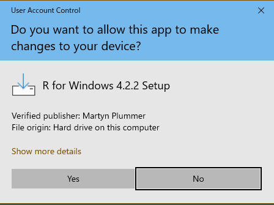
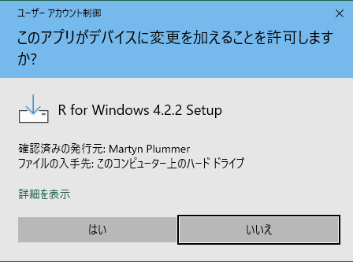

- インストール中に使用する言語   
何でも大丈夫なので，好きなものを選ぶ．


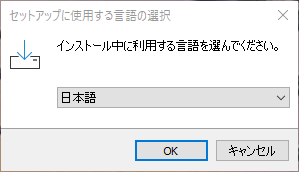


- インストールの確認   
「Next」「次へ」をクリック．


- インストール先のフォルダ   
そのままでOK．好みがあれば変更する．

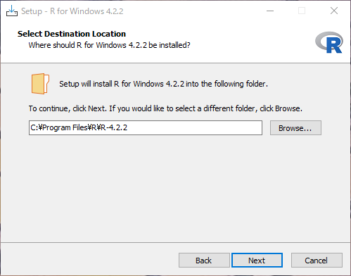

- インストールするもの

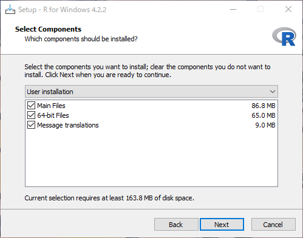


とりあえず，すべてチェックしておくくと良いです．
Message translationは，Rからのメッセージを日本語に翻訳するかどうかです．
チェックを入れないと，英語のみの表示です．

結論としえは，とりあえずチェックを入れておき，必要に応じて英語で表示させるという方法が良いかもしれません．
チェックを入れておくと，エラーメッセージなどを日本語で表示させることができます．
「そら日本語のほうが良いやん」と思うかもしれません．
ただでもよくわからないエラーメッセージが英語で表示されたら，わけがわからないからです．
ただ，プログラミングの世界では，英語でのエラーメッセージのほうが便利なことが結構あります．
それは，エラーメッセージをそのままネットで検索するときです．
日本語でのエラーメッセージだとネット上の情報が限られています．
一方，英語でのエラーメッセージで検索すると，原因や対処方法をかなりの確率で知ることができます．


```r
  # https://cell-innovation.nig.ac.jp/SurfWiki/R_errormes_lang.html
  Sys.getenv("LANGUAGE") # 設定の確認
  # 設定の変更方法
  Sys.setenv(LANGUAGE="en") # 英語に変更
  Sys.setenv(LANGUAGE="jp") # 日本語に変更
```

- オプションの選択  


とりあえず「Yes」を選択．
以下のオプションを選択するかどうか．


- ウィンドウの表示方法(MDI / SDI)の選択   

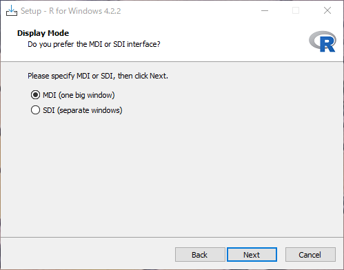

個人的な好みはSDIですが，好みの問題ですので正直どちらでも大丈夫．
MDIは大きな1つのWindowの中に，コンソール(プログラムの入力部分)，グラフ，ヘルプなどが表示される．
SDIはコンソール，グラフ，ヘルプが別々のWindowとして表示される．
どちらかといえば，自由度が高い．


- ヘルプの表示方法(Plain text / HTML help)の選択   

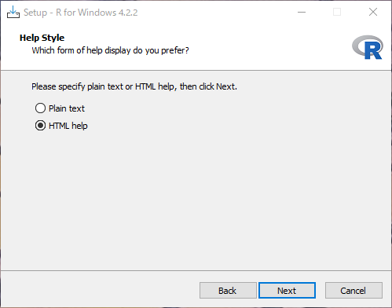

個人的な好みはPlain textだが，好みの問題ですので正直どちらでも構わない．
Plain textはテキストファイルで表示されるシンプルな作り．
HTML helpはヘルプがブラウザ(GoogleChrome等)で表示される．
関連する関数などへのリンクが表示されるので，それらを参照するのは便利．

- その後の設定

その他は，既定値(そのまま)でOK．


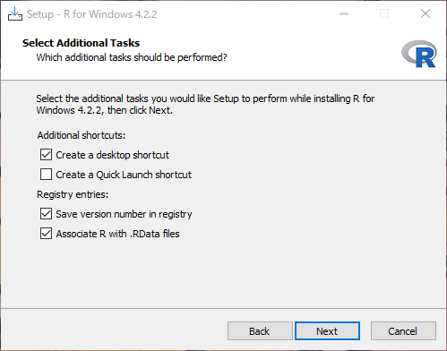
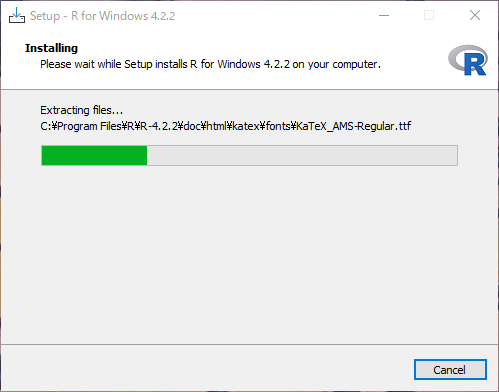
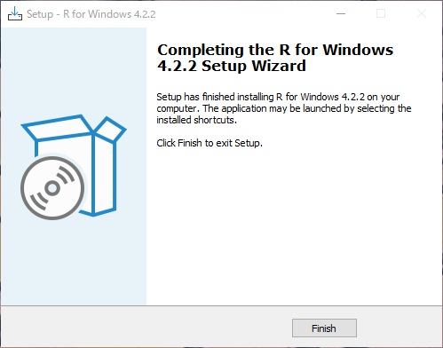


## インストール完了

インストールが完了すると，アイコンがデスクトップに表示される．

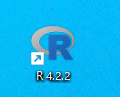
