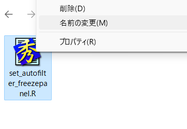
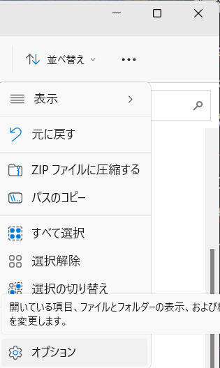
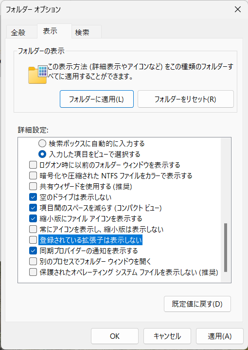
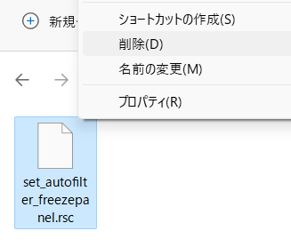
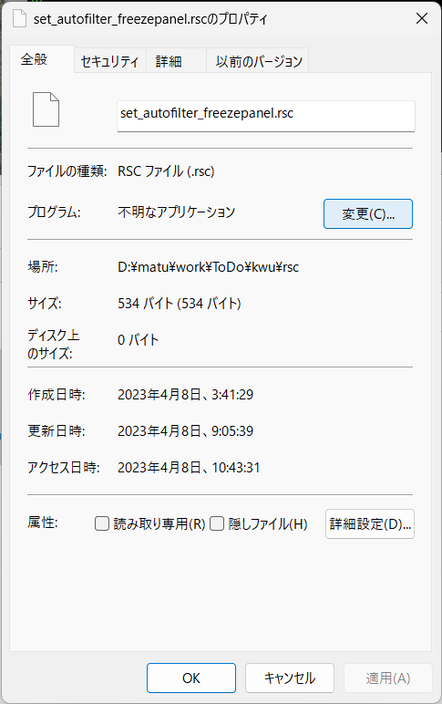
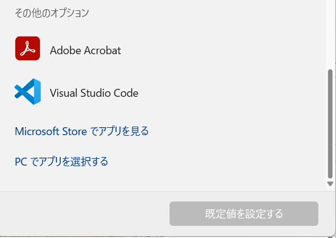
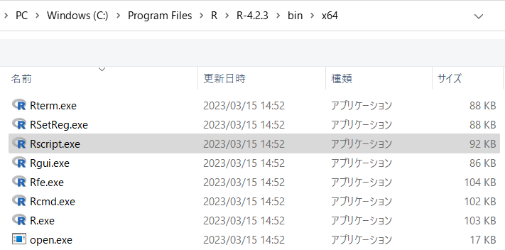
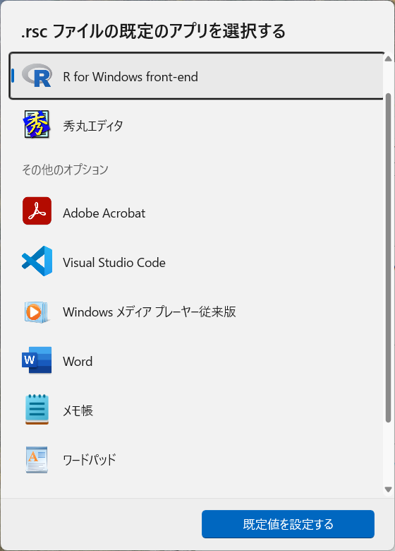
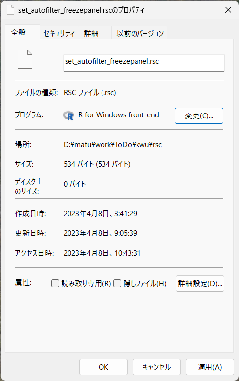
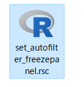

# スクリプトの関連付け {#assoc}

ここでは，Windowsでのファイルの関連付けについて説明する．

<!--
**TODO：**
Macでの関連付けの方法は，わかっていない．
Linuxについては，できるだろうがよく知らない
-->
Rのプログラムのファイルは拡張子「script.R」のように「R」という拡張子を付けて保存することが多い．
拡張子「docx」をワードで，「xlsx」をエクセルで開くのと同様に，私は「R」をテキストエディタで開くするように設定している．
その後，開いたファイルをRのコンソールに貼り付けて，プログラムを実行する．

このような使い方でもちろん良いのだが，コードの内容を変更しないのであれば，いちいちRを起動してコードを貼り付けるのは面倒臭い．
ファイルをクリックするだけで，プログラムが実行されれば便利である．
プログラムのファイルをRに関連付けることで，これが実現できる．

1. プログラムのファイル名を「R」から「scr」に変更する(「scr」は大文字小文字は関係なく，「Rsc」や「RSC」などでもOK)．   
{ width=30% }
0. 拡張子が表示されていない場合は，エクスプローラの表示のオプションで，「登録されている拡張子は表示しない」のチェックを外して(チェックしないで)，「OK」を選択してから，名前を変更する．   
{ width=40% }
{ width=40% }
2. ファイルを右クリックして，「プロパティ」を選択する．   
{ width=30% }
3. 「全般」タブのやや上にあるプログラムの「変更」を選択する．   
{ width=50% }
4. 「PCでアプリを選択する」をクリックする．   
{ width=50% }
5. ファイル選択画面で，Rをインストールしたフォルダまで辿っていき(「c:\\Program files\\R\\R-4.2.3\\bin\\x64」など)，「Rscript.exe」を選択する．   
{ width=50% }
6. 「.rscファイルの既定のアプリを選択する」で「R for windows front-end」が表示されるので，「既定値を設定する」を選択する．   
{ width=50% }
7. 全般タブのプログラムが「R for windows front-end」になっていることを確認して．「OK」を選択する．   
{ width=50% }
8. ファイルのアイコンがRのアイコンになっていたらOKである．   
{ width=30% }

ダブルクリックすると，ファイルの内容が実行される(はず)．
