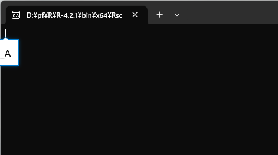

# openxlsxでエクセル操作 {#openxlsx}

Rで解析するときの元データとしてcsv(カンマ区切りのテキスト)やtsv(タブ区切りのテキスト)として使っているが，エクセル形式でデータが提供されることもよくある．
エクセルで開いてからcsvなどに保存し直しても良いが，手作業が面倒である．
どうせなら，エクセルファイルそのものからデータを取得したい．
また，逆にRで分析した結果をデータをエクセル形式で提供したいこともある．
いや，正確には提供したいというか，こっちはそんなことはないのだが，提供される側にそれを求められることがある．

readxlパッケージを使えば簡単にデータの読み書きができるものの，内容は単純なものでcsvをエクセルに貼り付けただけになってしまう．
折角ならエクセルのオートフィルタの設定やウィンドウ枠の固定を使ったり，セルの幅を自動で調整したり，罫線を引いたりもしておきたい．
そんなときには，openxlsxパッケージが便利である．
上記の操作をRから実行できるようにすれば，既存のエクセルのワークブックを開いて，各種操作をして，上書き保存することが自動化できる．
ここでは，そのような技を紹介する．

なお，エクセルのワークブックを操作するパッケージとしてxlsxやexcel.linkなどもあり，類似の機能を提供している．
また，openxlsxの後継としてopenxlsx2があるものの，開発中でありAPI変更の可能性があるらしい．

## 準備

まずは，パッケージをCRANからインストールして，呼び出しておく．


```r
install.package("openxlsx")
```


```r
library(tidyverse)
library(openxlsx)
  # remotes::install_github("matutosi/pivotea")
library(pivotea)
data(hogwarts)


timetable <- 
  hogwarts %>%
  pivot(row = c("grade", "hour"), col = "wday", value = c("subject", "teacher"), split = "house")


tmp <- fs::file_temp(ext = "xlsx")
openxlsx::write.xlsx(timetable, tmp)
wb <- openxlsx::loadWorkbook(tmp)
```


## 列幅の変更，オートフィルタの設定，ウィンドウ枠の固定

openxlsxでは，`setColWidths()`で列幅の変更，`addFilter()`でオートフィルタの設定，`freezePane()`ウィンドウ枠の固定ができる．
ワークブック名やシート名などともに，それぞれで設定するべき値を指定する．
なお，openxlsxでは副作用でワークブックの中身を更新するので，関数を適用したあとに，オブジェクトへの代入は不要である．
不要というよりは，正確には代入してはならない．
関数の戻り値が`invisible(0)`であるためだ．

列幅を指定する`setColWidths()`では， `width =  "auto"`とすると，自動的に適切な幅に設定してくれる．
エクセルの列の境界のところでダブルクリックをすると適切な幅にしてくれるのと，同様である．

`setColWidths()`，`addFilter()`，`freezePane()`で各シートでの設定をしたら，
最後に，`saveWorkbook()`でワークブックを保存する．


```r
for(sheet in sheets(wb)){
  df <- openxlsx::readWorkbook(wb, sheet)
  openxlsx::setColWidths(wb, sheet, cols = 1:ncol(df), width =  "auto")
  openxlsx::addFilter(wb, sheet, row = 1, cols = 1:ncol(df))
  openxlsx::freezePane(wb, sheet, firstCol = TRUE, firstRow = TRUE)
}
openxlsx::saveWorkbook(wb, tmp, overwrite = TRUE)
```


列幅の変更・オートフィルタの設定・ウィンドウ枠の固定のいずれもシートごとに作業しなければならない．
これは手作業でもopenxlsxでも同じである．
ただし，手作業の場合はファイルやシートが増えれば増えるほど，面倒くささが増加する．
面倒なだけでなく，作業の間違いも当然発生するだろう．
エクセルでも自動化は可能であるが，それでも手作業は必要である．

openxlsxで自動化した場合でも，もちろんプログラムの実行時間はファイル数やシート数に比例して増加する．
しかし，Rとopenxlsxに作業をしてもらっている間，ユーザ(あなたや私)は別のことに時間を使うことができる．
他の仕事をやっつけるのもよし，ほっと一息をついてコーヒを飲んでもよい．


## 罫線の設定

列幅・オートフィルタ・ウィンドウ枠の3点セットは，データを保存するワークブックであれば，設定しておきたいものなので，自動化と非常に相性が良い．
それ以外にも，特定のところに罫線を引いて見栄えを良くしたいことがある．
例えば，全体的には縦横に細線を，`grade`が変わるところには二重線を引くとする．

フォントを変更したり，罫線を引いたり，セルの塗りつぶしをしたりするなどするには，まずは`createStyle()`でスタイルを作成する．
詳細はヘルプで確認してほしいが，罫線に関しては`border`，`borderColour`，`borderStyle`で罫線の位置，色，種類を設定する．
ここでは細線と二重線を使うので，それぞれの罫線をまず設定する．


```r
sty_thn <- openxlsx::createStyle(border = "TopBottomLeftRight", borderStyle = "thin")
sty_dbl <- openxlsx::createStyle(border = "top", borderStyle = "double")
```

設定したスタイルは，`addStyle()`で各セルに追加する．
ワークブック，シート，スタイルセルの位置などを設定する．

セルの位置指定では，`gridExpand`とすると，`rows`と`cols`の組み合わせを拡張してくれるので便利だ．
具体的には，`rows = 1:10, cols = 2:3`とすると，1-10行目のB列とC列のセルすべて，つまり`B1:C10`という指定と同じになる．
個別に設定したい場合は，`gridExpand`を設定しない．
その場合は，`rows`と`cols`のベクトルの長さを同じにする必要がある．
例えば，`rows = c(1, 3, 5), cols = c(2, 4, 6)`とすれば，`B1`，`D2`，`F5`のセルを指定できるが，
`rows = c(1, 3, 5), cols = c(2, 4)`はエラーになる．

`stack = TRUE`を指定すると，指定外の既存のスタイルに，さらにスタイルを積み重ねていく，つまり追加していくことができる．
`stack = TRUE`を指定しないと，新たなスタイルが設定されるので，指定外のスタイルはデフォルトのものになる．


```r
wb <- openxlsx::loadWorkbook(tmp)
for(sheet in openxlsx::sheets(wb)){
  df <- openxlsx::readWorkbook(wb, sheet)
  new_grade <- 
    seq_along(df$grade)[df$grade != dplyr::lag(df$grade)] %>%
    `[<-`(1, 1) %>%
    `+`(1)
  openxlsx::addStyle(wb, sheet, style = sty_thn, rows = 1:nrow(df), cols = 1:ncol(df), gridExpand = TRUE, stack = TRUE)
  openxlsx::addStyle(wb, sheet, style = sty_dbl, rows = new_grade , cols = 1:ncol(df), gridExpand = TRUE, stack = TRUE)
}
openxlsx::saveWorkbook(wb, tmp, overwrite = TRUE)
```
<!--
shell(tmp)
-->

上のコードでは，`grade`の境界だけを二重線にするためにちょっとややこしいコードになってしまっている．
各シートのデータを`df`に代入しているので，学年のデータを`df$grade`として取得している．
具体的には，`Automatic`では，以下のようになっている．


```r
df$grade
```

```
##  [1] "6" "6" "6" "6" "6" "6" "6" "7" "7" "7" "7" "7" "7" "7"
```

```r
##  [1] "6" "6" "6" "6" "6" "6" "6" "7" "7" "7" "7" "7" "7" "7"
```

ここから，境界部分を取り出すために`lag()`で1つずらしたベクトルを作成して，元のベクトルと比較して，異なる位置を取得している．
`[<-()`という関数は，`x[1] <- 1`のようなことをパイプの中で実行するためのものである．
ここでは，`grade`の最初の部分にも二重線を引きたいので，1つ目の`NA`を置換している．
また，`+()`も四則演算をパイプ内でするために通常の関数と同じように使っている．
ここでは，1行目が列名であるため，1行ずらすために1を追加している．


```r
seq_along(df$grade)[df$grade != dplyr::lag(df$grade)] %>%
print() %>%
`[<-`(1, 1) %>%
print() %>%
`+`(1)
```

若干説明が長くなってしまったが，上記のコードを実行すれば，エクセルのワークブックに罫線を引くことができる．
1回だけの作業ならコードを書くのは面倒だが，何度も同じ作業を繰り返す場合は，コードを書く価値があるだろう．


## ヘッダーとフッターの追加

ヘッダーとフッターを設定するには，`setHeaderFooter()`を使う．
他の関数と同様に，ワークブック，シート番号(シート名)とともに，`header`と`footer`でヘッダーとフッターの内容を指定する．
ヘッダー(フッター)は，`c("left", "center", "right")`のように，左・中央・右のヘッダー(フッター)に入れたい内容を指定する．
このとき，3つとも指定する必要があり，何も入れたくないときには，`c(NA, NA, "right")`のように`NA`とする．
また，エクセルでの作業と同様に，ページ番号やシート名などを入れたいときは，以下の文字列を指定する．
さらに，`evenHeader`と`evenFooter`で偶数ページの，`firstHeader`と`firstFooter`で最初のページのヘッダーとフッターを指定することも可能である．


```
&[Page]  # ページ番号
&[Pages] # 全ページ数
&[Date]  # 現在の日付
&[Time]  # 現在時刻
&[Path]  # ファイルのパス
&[File]  # ファイル名
&[Tab]   # シート名
```

次のように設定して保存すると，エクセルのファイルでもちゃんと設定されている．


```r
wb <- openxlsx::loadWorkbook(tmp)
setHeaderFooter(wb, 1, header = c("&[Date]", "ALL HEAD CENTER", "&[Page] / &[Pages]"))
openxlsx::saveWorkbook(wb, tmp, overwrite = TRUE)
```


## 作業の自動化

上記作業のうち，列幅・オートフィルタ・ウィンドウ枠の3点セットは自動化しておいて損のない作業である．
そこでここでは，これらを実行するスクリプトを作成し，特定のディレクトリにある全てのエクセルのワークブックに一発で設定できるようにする．
基本的なコードは既に出来上がっているので，ファイル名の一覧を取得して，ファイルごとにforループで回すようにするだけだ．
forループではなく，`purrr::map()`を使ってもよいのだが，イントールするパッケージを少なくするためにforを使っている．

### スクリプトの内容

Rに慣れていない人でもスクリプトを使えるようにするために，Rのインストールだけは必須であるが，それ以外の作業は自動化しておきたい．
そこで，パッケージopenxlsxのインストールをスクリプトに含めている．
あとは，fsパッケージの`dir_ls()`でエクセルの一覧を取得して，各ファイルに列幅の変更・オートフィルタの設定・ウィンドウ枠の固定の3点セットを実行する関数を適用すれば完成である．


```r
  # パッケージの確認
if(!require("openxlsx", quietly = TRUE)){
  options(repos = "https://cran.ism.ac.jp/")
   utils::install.packages("openxlsx")
}

  # ワークブックごとで設定
set_af_fp <- function(file){
  wb <- openxlsx::loadWorkbook(file)
  for(sheet in openxlsx::sheets(wb)){
    df <- openxlsx::readWorkbook(wb, sheet)
    openxlsx::setColWidths(wb, sheet, cols = 1:ncol(df), width =  "auto")
    openxlsx::addFilter(wb, sheet, row = 1, cols = 1:ncol(df))
    openxlsx::freezePane(wb, sheet, firstCol = TRUE, firstRow = TRUE)
  }
  openxlsx::saveWorkbook(wb, file)
}

  # 本体
files <- fs::dir_ls(regexp = "\\.xlsx*") # ".xls"と".xlsx"の一覧取得
for(file in files){                      # ファイル数だけ繰り返し
  set_af_fp(file)                        # set_af_fp()の実行
}
```

### 使用方法   
- 準備：<a href="https://matutosi.github.io/retc/install.html">Rのインストール</a>    

- 準備：<a href="https://gist.githubusercontent.com/matutosi/fe217c7ed934dd242d6798aca846d902/raw/c7b93586db398f801d469bd98a9e764a04a4a8e2/set_autofilter_freezepanel.rsc" download>set_autofilter_freezepanel.rsc</a>
をダウンロード(右クリックして「名前を付けてリンク先を保存」)して，任意のフォルダに保存．   

- 準備：<a href="https://matutosi.github.io/retc/assoc.html">スクリプトの関連付け</a>を参考にして，「.rsc」を「Rscript.exe」に関連付けする(Windowsの場合)．   
   Macの場合は，<a href="https://pc-karuma.net/mac-extension-related-app-change/">Mac - 拡張子に関連付けられているアプリを変更する方法</a>などを参考にしてほしい．   

- set_autofilter_freezepanel.rsc と同じフォルダに，処理したいエクセルのファイルを保存．   
{ width=80% }    

- 実行前のエクセルのファイル   
{ width=40% }    

- set_autofilter_freezepanel.rsc をダブルクリックして実行すると，コマンドのウィンドウでプログラムが実行される．   
{ width=40% }   
プログラムがオートフィルタを設定し，1行目と1列目でウィンドウ枠を固定する．
複数ファイル・複数シートにも対応している．   
なお，初回実行時は，openxlsxパケージのダウンロードのため，少し時間がかかるかもしれない．
2回目以降はファイル数が多すぎなければ，一瞬で処理されるはず．   
実行後のエクセルのファイル   
{ width=40% }   


