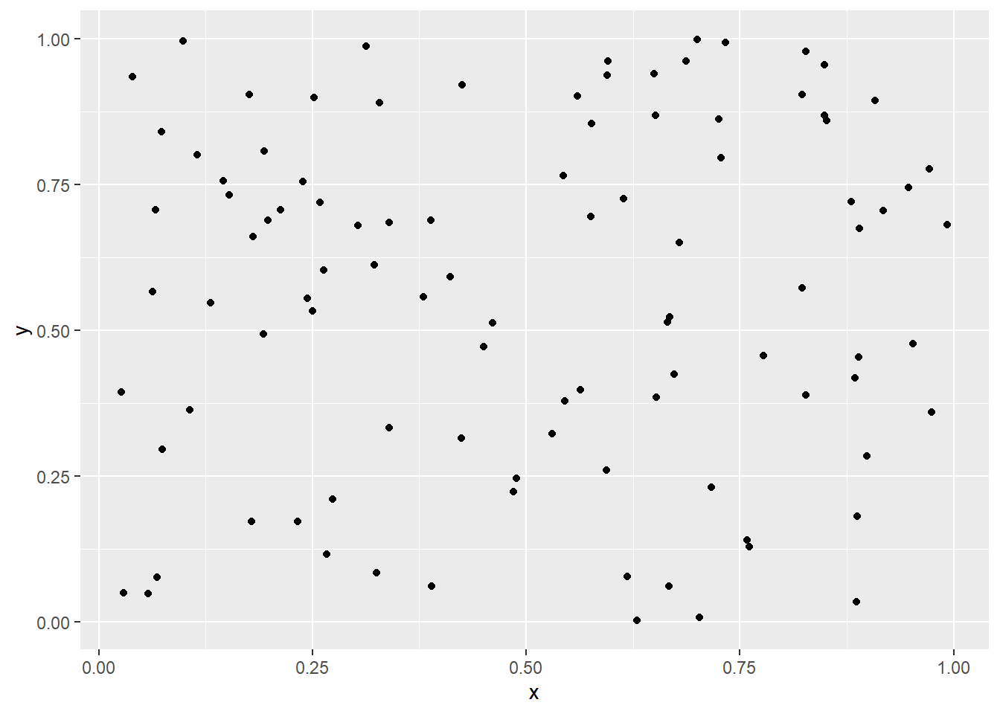

# reticulateでPythonを使う {#reticulate}

RとPythonのパッケージは，相互に移植されていることが多い．
例えば，Pythonのlogging(とRのfutile.logger)をもとにRのパッケージloggerは開発されている．
https://cran.r-project.org/web/packages/logger/index.html
また，Rのggplot2やdplyrはPythonにも移植されている．

ただし，どちらか片方でしか利用できなかったり，使用方法が難しいことがある．
そんなとき，ちょっとだけ使うのであれば，Rのパッケージreticulateが便利である．
もちろん，Pythonをちゃんと勉強するのも良いだろう．
さらに，reticulateを使うとRとPythonとの変数のやり取りが簡単にできるので，本格的にPythonを使うのにも良さそう．

## 準備


```r
install.packages("reticulate")
```


```r
library(tidyverse)
library(reticulate)
library(automater)
```

### PythonとPyAutoGUIのインストール

[Pythonとそのライブラリのインストール](#install_python)を参照して，PythonとPyAutoGUIをインストールしておく．

ライブラリの一覧の中に，あとで使うnumpy，matplotlib，artがなければインストールしておく．
なお，この文書ではPythonをパッケージ版でインストールしするとともに，pipでパッケージを管理している．
Anacondaやminicondaで仮想環境を使用している場合は，`retuculate::conda_install()`でパッケージをインストールする．


```r
system("pip list", intern = TRUE) %>%
  tibble::as_tibble() %>%
  dplyr::filter(stringr::str_detect(value, "numpy|matplotlib|art"))
## A tibble: 0 × 1
## ℹ 1 variable: value <chr>
system("pip install numpy", intern = TRUE)
system("pip install matplotlib", intern = TRUE)
system("pip install art", intern = TRUE)
```

### 使用するPythonの指定 {#identify_python}

バージョンや形態の異なるPythonを複数インストールすることが可能である．
[Pythonとそのライブラリのインストール](#install_python)で説明したようなPythonパッケージのインストーラを用いたもの(パッケージ版Python)もあれば，Microsoft Store版のPythonもある．
さらに，Anacondaをインストールしてその中でPythonを使うこともできる．
色々とあってややこしいが，この文章ではパッケージ版Pythonを使うことにする．
reticulateで使用するPythonとしてインストールしたパッケージ版Pythonを指定する．
なお，AnacondaなどにあるPythonを使う場合は，別途インストールして，`use_condaenv()`で指定する．


```r
find_python <- function(){
  os <- automater::get_os()
  python_path <- 
    ifelse(os == "win", "where python", "which python") %>%
    system(intern = TRUE) %>%
    fs::path() %>%
    stringr::str_subset("Python311")
  return(python_path)
}

path <- find_python()
path
```

```
## [1] "C:/Users/matu/AppData/Local/Programs/Python/Python311/python.exe"
```

```r
reticulate::use_python(path)
```

`path`に複数の文字列が入っているときは，複数のPythonがインストールされている．
例えば，以下のような文字列が入っている可能性がある

C:/Users/your_user_name/AppData/Local/r-miniconda/envs/r-reticulate/python.exe
C:/Users/your_user_name/AppData/Local/Microsoft/WindowsApps/python.exe

このように複数の文字列がpathに入っているときは，`path[1]`のように指定しなければならない．
上記のうち，後者(最後がWindowsApps/python.exeの方)のときは，アプリ実行エイリアスの設定でチェックを外すと良い．

参考：https://hrkworks.com/it/programming/python/py-4421/

## Pythonを使ってみる

### Pythonの呼び出し

`repl_python()`を実行するとRからPythonを呼び出すことができる．
Python実行時にはコンソールが`>`から`>>>`に変化する．

古典的なことだが，まずはHellow World!を実行する．
"Hellow World!"が出力されたら成功である．
`>>>`のときに`quit`か`exit`とすればRに戻る．


```r
repl_python()
## Python 3.11.1 (C:/Users/matu/AppData/Local/Programs/Python/Python311/python.exe)
## Reticulate 1.28 REPL -- A Python interpreter in R.
## Enter 'exit' or 'quit' to exit the REPL and return to R.
>>> print("Hello World!")
## Hellow World!
>>> quit
```

他にもPythonで実行したいことがあれば，`>>>`のときに入力する．

### RからPythonのHellow World

Pythonにあらかじめ用意されているビルトイン関数を使うには，`import_builtins()`を使う．
`import_builtins()`で生成したオブジェクトに`$`とPythonの関数名をつければ，Rの関数として使うことができる．


```r
builtins <- reticulate::import_builtins()
builtins$print('Hellow World!')
```

ふつうにHellow Worldをしていても面白くないので，ちょっと変わったHellow Worldをしてみる．
ライブラリartを呼び出して，Hellow World!をするとちょっと面白い．


```r
art <- reticulate::import("art")
art$tprint("Hellow World!")
##  _   _        _  _                   __        __              _      _  _ 
## | | | |  ___ | || |  ___  __      __ \ \      / /  ___   _ __ | |  __| || |
## | |_| | / _ \| || | / _ \ \ \ /\ / /  \ \ /\ / /  / _ \ | '__|| | / _` || |
## |  _  ||  __/| || || (_) | \ V  V /    \ V  V /  | (_) || |   | || (_| ||_|
## |_| |_| \___||_||_| \___/   \_/\_/      \_/\_/    \___/ |_|   |_| \__,_|(_)
art$tprint("FUN", font = "block", chr_ignore = TRUE)
##  .----------------.  .----------------.  .-----------------.
## | .--------------. || .--------------. || .--------------. |
## | |  _________   | || | _____  _____ | || | ____  _____  | |
## | | |_   ___  |  | || ||_   _||_   _|| || ||_   \|_   _| | |
## | |   | |_  \_|  | || |  | |    | |  | || |  |   \ | |   | |
## | |   |  _|      | || |  | '    ' |  | || |  | |\ \| |   | |
## | |  _| |_       | || |   \ `--' /   | || | _| |_\   |_  | |
## | | |_____|      | || |    `.__.'    | || ||_____|\____| | |
## | |              | || |              | || |              | |
## | '--------------' || '--------------' || '--------------' |
##  '----------------'  '----------------'  '----------------' 
```

遊んでばかりいても仕方ないので，ちょっと真面目に使ってみる．
Pythonで，`np.random.rand`と表記するものをRで使うには，`np$random$rand`とする．
Rのオブジェクトに代入してしまえば，あとは慣れたもので簡単に散布図が作成できる．


```r
np <- reticulate::import("numpy") # import numpy as npと同じ
x <- np$random$rand(as.integer(100))
y <- np$random$rand(as.integer(100))
tibble::tibble(x, y) %>%
  ggplot2::ggplot(aes(x, y)) +
    ggplot2::geom_point()
```




## PythoとRとの変数のやり取り

行ったり来たりつつRとPythonを使いたいことがあるかもしれない．
つまり`repl_python()`を使ってPythonに入って，`exit`でRでに戻って，またPythonに入るなどである．
そのときに，RとPythonの変数のやりとりができる．

PythonでRの`variable`という変数を取り出したいときは`r.variable`，RでPythonの`variable`という変数を取り出したいときには`py$variable`とする．


```r
r.variable  # RからPythonへ(Pythonで取り出し)，variableは変数名
py$variable # PythonからRへ(Rで取り出し)
```

これでRとPythonを対話的に行きつ戻りつしながら実行できる．


```r
a <- "r_val"
repl_python(quiet = TRUE)
>>>r.a
## 'r_val'
>>>a = "python_val"
>>>exit
py$a
## [1] "python_val"
```

## Pythonのコードを実行

既にPythonの関数やコードのファイルがある場合は，`source_python()`でファイルを読み込んで使うことができる．

<!--
TODO：Pythonらしいコードを入れる
  # https://techblog.nhn-techorus.com/archives/8329
-->


```r
reticulate::source_python()
```

`source_python()`でのコード内の関数や変数をそのままRで使うことができる．


```r
reticulate::py_run_file("script.py")
reticulate::py_run_string("x = 10")
```


`py_run_file()`や`py_run_string()`でのコード内の変数や関数をRで使う場合は，`py$val`のように`py$`の後ろに変数や関数の名前を付ける必要がある．


## RとPythoでの用語の違い


Pythonでのモジュールとはファイル(`*.py`)のことで，モジュールをまとめたものがパッケージ，パッケージをまとめたものがライブラリである．
このライブラリを`pip install`でインストール，`import()`でインポートしている．
つまり，Rでのパッケージにあたるのが，Pythonでのライブラリである．


<!--
  ## Pythonでのモジュール(パッケージ)のインストール
Rstudioでpythonを書く (reticulate)
https://qiita.com/Wa__a/items/42129e529cfb6c38e046

py_install()やconda_install()でパッケージがインストールできないとき
- pip でパッケージをインストール   
- pipでインストールできたpythonをreticulate::use_python()で指定
-->


<!--
```
## memo
  # pdf2docxのインストール   
pip install pdf2docx
```


```r
  # pdf2docxの読み込みでエラーになるとき
  #   reticulate::use_python()でpythonを指定
  #   pipでpdf2docxがインストールできたpythonを使う
library(reticulate)
  # reticulate::py_install("pdf2docx") エラー
  # https://anaconda.org/conda-forge/python-docx
  # reticulate::conda_install(channel = "conda-forge", packages = "python-docx")  # できたけど，pdf2docxは読み込めず
reticulate::use_python("C:/Python/Python39/python.exe")
reticulate::py_run_string("from pdf2docx import parse")
reticulate::py_run_string("pdf_file = 'D:/a.pdf'")
reticulate::py_run_string("docx_file = 'D:/a.docx'")
reticulate::py_run_string("parse(pdf_file, docx_file)")
```
-->


```r
  # USB取り出し用の画像のトリミング(作業済)
  #   トリミングをしたほうが画像認識がうまくいくかとおもったが，逆にダメだった
  # library(tidyverse)
  # path <- 
  #   "D:/matu/work/ToDo/automater/inst/img" %>%
  #   fs::dir_ls(regexp = "png") 
  # img <- 
  #   path %>%
  #   purrr::map(magick::image_read) %>%
  #   purrr::map(magick::image_trim)
  # purrr::map2(img, path, magick::image_write)
  # path
```


```r
  # 画面サイズの取得だが，実際は拡大をしていたりするので，ちょっと数字が違う
  # system("wmic path Win32_VideoController get VideoModeDescription,CurrentVerticalResolution,CurrentHorizontalResolution /format:value")
```

