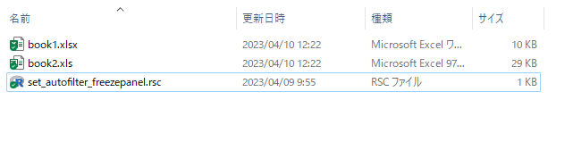
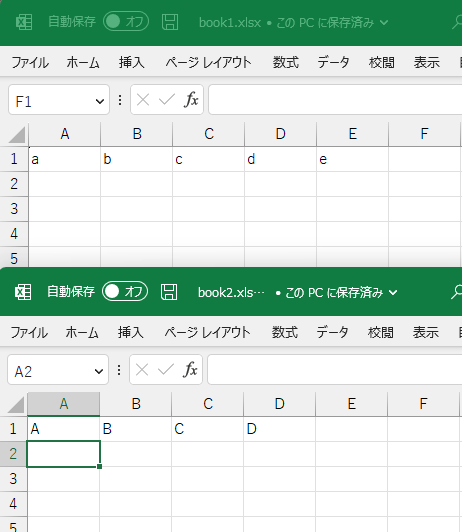
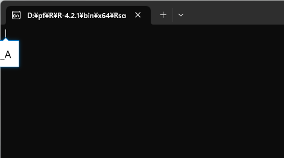
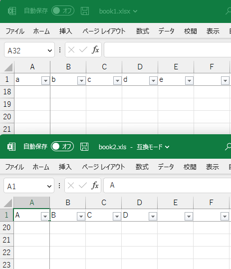

# xlsxでエクセル操作 {#xlsx}

xlsxパッケージを使うと，エクセルのファイルの読み込み・書き込みをはじめ，
オートフィルタの設定やウィンドウ枠の固定などの各種操作が可能である．


## オートフィルタの設定とウィンドウ枠の固定の自動化スクリプト

xlsxの使用例として，オートフィルタを設定して・ウィンドウ枠を固定する自動化スクリプトを作成した．

### 使用方法   
- 準備：<a href="https://matutosi.github.io/retc/install.html">Rのインストール</a>    
- 準備：<a href="https://gist.githubusercontent.com/matutosi/fe217c7ed934dd242d6798aca846d902/raw/c7b93586db398f801d469bd98a9e764a04a4a8e2/set_autofilter_freezepanel.rsc" download>set_autofilter_freezepanel.rsc</a>
をダウンロード(右クリックして「名前を付けてリンク先を保存」)して，任意のフォルダに保存．   
- 準備：<a href="https://matutosi.github.io/retc/assoc.html">スクリプトの関連付け</a>を参考にして，「.rsc」を「Rscript.exe」に関連付けする(Windowsの場合)．Macの場合は，<a href="https://pc-karuma.net/mac-extension-related-app-change/">Mac - 拡張子に関連付けられているアプリを変更する方法</a>などを参考にしてほしい．   
- set_autofilter_freezepanel.rsc と同じフォルダに，処理したいエクセルのファイルを保存．   
{ width=80% }    
- 実行前のエクセルのファイル   
{ width=40% }    
- set_autofilter_freezepanel.rsc をダブルクリックして実行すると，黒い画面が表示されてプログラムが実行される．   
{ width=40% }   
プログラムが自動的にエクセルのファイルの1行目のA列からZ列までにオートフィルタを設定し，1行目と1列目でウィンドウ枠を固定する．
複数ファイル・複数シートにも対応している．   
なお，初回実行時は，xlsxパケージのダウンロードのため，少し時間がかかるかもしれない．
2回目以降はファイル数が多すぎなければ，一瞬で処理されるはず．   
実行後のエクセルのファイル   
{ width=40% }   

### スクリプトの内容説明   


```r
  # Package, 準備
if(! "xlsx" %in% installed.packages()[,1]){  # xlsxパッケージ有無の確認
  # パッケージが無い場合
  options(repos = "https://cran.ism.ac.jp/") # ミラーサイトの設定
  install.packages("xlsx")                   # パッケージのインストール
}

  # Functions, 関数
  #   註：xlsxパッケージの関数は返り値の代入がない
  #         副作用でシートなどを操作するため?
  #         参照型を使っているため?
  #   参考：通常のRの関数は，返り値の代入をすることが多いの

  # オートフィルタの設定
set_auto_filter <- function(sh){
  # A1からZ1までを設定
  #   もっと多くの列で設定したければ，"A1:Z1"のところを修正する
  xlsx::addAutoFilter(sh, "A1:Z1")
}

  # ウィンドウ枠の固定
set_freeze_panel <- function(sh){
  # 1列目と1行目のウィンドウ枠を固定
  #   固定する場所の変更方法
  #     2行目までを固定したい場合は，引数の2つ目と4つ目を，3にする
  #     3列目までを固定したい場合は，引数の3つ目と5つ目を，4にする
  xlsx::createFreezePane(sh, 2, 2, 2, 2)
}

  # ワークブックごとで設定
set_af_fp <- function(file){
  wb <- xlsx::loadWorkbook(file)   # ワークブックの読み込み
  for(sh in xlsx::getSheets(wb)){  # シートの数だけ繰り返し
    set_auto_filter(sh)            #   オートフィルタの設定
    set_freeze_panel(sh)           #   ウィンドウ枠の固定
  }
  xlsx::saveWorkbook(wb, file)     # ワークブクの保存
}

  # Main, 本体
files <- list.files(pattern = "xls") # ".xls"と"xlsx"の一覧取得
for(file in files){                  # ファイルの数だけ繰り返し
  set_af_fp(file)                    # set_af_fp()の実行
}
```


## その他の操作(未作成)


